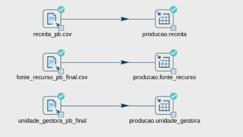
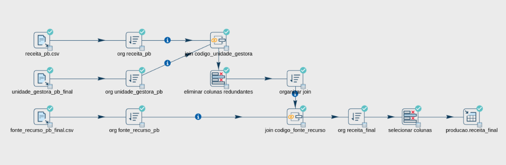
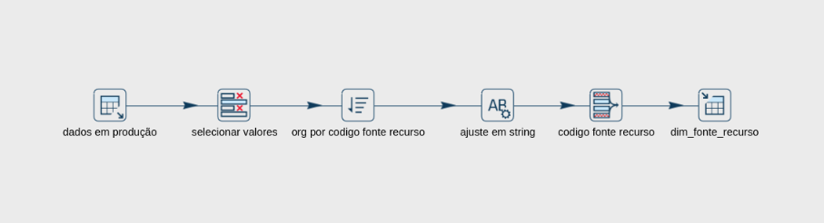
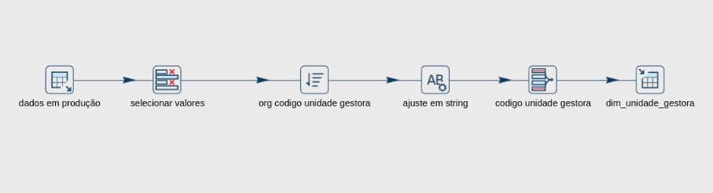
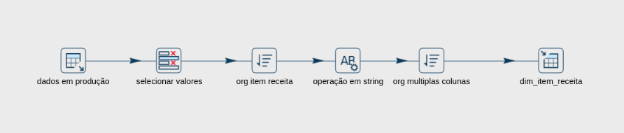
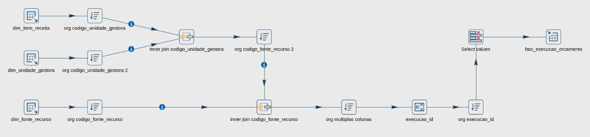

# Acompanhamento da Execução Orçamentária do estado da Paraíba, Brasil
# 1.0. - Sumário
Esse projeto tem como objetivo realizar a observação da Execução Orçamentária do estado da Paraíba. 
O projeto foi desenvolvido como uma forma de demonstrar nossas habilidades como Engenheiro de Dados, enquanto utilizando um conjunto de dados públicos disponibilizados pela Plataforma de dados abertos do Estado da Paraíba e mantido pela CODATA - Companhia de Processamento de Dados da Paraíba. 
Os dados foram obtidos no portal através do endereço a seguir: https://dados.pb.gov.br/, um banco de dados em produção foi abastecido com esses dados brutos, em seguida foi realizado um processo de ETL com Apache Hop para um Data Warehouse, sendo analisados e disponibilizados em formatos de painéis utilizando a ferramenta Metabase. 
Toda a infraestrutura do projeto foi modularizada com Docker e as ferramentas podem ser montadas com a ajuda de Docker Compose utilizando o script em docker-compose.yml aqui disponibilizado.

# 2.0. - Dicionário de Dados
As descrições dos dados a seguir foram disponibilizadas pelo própria Plataforma de Dados Abertos do Estado da Paraíba. 
Buscamos os dados da Execução Orçamentária e enriquecemos esse conjunto com os dados das Unidades Gestoras e Fontes de Recursos, como foram de obter maior legibilidade para o conjunto de dados.

## 2.1. - Receitas - Execução
| CAMPO                               | TIPO DE CONTEÚDO | TAMANHO | DESCRIÇÃO                                                     |
|-------------------------------------|------------------|---------|---------------------------------------------------------------|
| * EXERCICIO                         | Inteiro          |         | Exercício fiscal, o ano da receita                            |
| * MES                               | Inteiro          |         | O mês de arrecadação da receita                               |
| * CODIGO_UNIDADE_GESTORA            | Texto            |       6 | Código SIAF do Órgão (Unidade Gestora)                        |
| * CODIGO_ITEM_RECEITA               | Texto            |       9 | Código completo do item da receita                            |
| NOME_ITEM_RECEITA                   | Texto            |     200 | Descrição do item da receita                                  |
| CODIGO_FONTE_RECURSO                | Texto            |       5 | Código da Fonte de Recurso                                    |
| VALOR_MES                           | Numérico         |    18,2 | Importância arrecadada no mês                                 |
| CODIGO_CATEGORIA_RECEITA            | Texto            |       1 | Código da categoria econômica da receita                      |
| CODIGO_ORIGEM_RECEITA               | Texto            |       1 | Código da origem da receita                                   |
| CODIGO_ESPECIE_RECEITA              | Texto            |       1 | Código da espécie da receita                                  |
| CODIGO_RUBRICA_RECEITA              | Texto            |       1 | Código da rubrica da receita                                  |
| CODIGO_ALINEA_RECEITA               | Texto            |       2 | Código da alínea da receita                                   |
| CODIGO_SUBALINEA_RECEITA            | Texto            |       2 | Código da sub alínea da receita                               |

(*) CHAVE PRIMÁRIA

## 2.2. - Unidade Gestora
| CAMPO                               | TIPO DE CONTEÚDO | TAMANHO | DESCRIÇÃO                                                     |
|-------------------------------------|------------------|---------|---------------------------------------------------------------|
| EXERCICIO                           | Inteiro          |         | Exercício fiscal, o ano da despesa                            |
| CODIGO_UNIDADE_GESTORA              | Texto            |       6 | Código SIAF do Órgão (Unidade Gestora)                        |
| SIGLA_UNIDADE_GESTORA               | Texto            |      20 | Sigla do Órgão (Unidade Gestora)                              |
| NOME_UNIDADE_GESTORA                | Texto            |     100 | Nome do Órgão (Unidade Gestora)                               |
| TIPO_ADMINISTRACAO_UNIDADE_GESTORA  | Texto            |       1 | Identificação do Tipo de Administração da Unidade Gestora     |

## 2.3. - Fonte de Recursos
| CAMPO                               | TIPO DE CONTEÚDO | TAMANHO | DESCRIÇÃO                                                     |
|-------------------------------------|------------------|---------|---------------------------------------------------------------|
| EXERCICIO                           | Inteiro          |         | Exercício fiscal, o ano da despesa                            |
| CODIGO_FONTE_RECURSO                | Texto            |       5 | Código da Fonte de Recurso                                    |
| NOME_FONTE_RECURSO                  | Texto            |     150 | Denominação da Fonte de Recurso                               |

# 3.0. - Tecnologias Utilizadas
## 3.1. - Ferramentas 
- Poetry (Criação de ambiente virtual, controle de pacotes e bibliotecas)
- Docker (Modularização das ferramentas)
- Python 3.12
    - Pandas (Manipulação de dados)
    - Requests (Requisições HTTP)
- Apache Hop (Processo de ETL)
- MariaDB (Banco de dados utilizado em Produção)
- PostgreSQL (Banco de Dados utilizado como Data Warehouse)
- Metabase (Painéis para análise de dados)

## 3.2. - Requerimentos em Python
Os requerimentos estão disponibilizados no arquivo pyproject.toml e podem ser instalados com Poetry ou manualmente com um gerenciador de pacotes.
- python = "^3.12"
- pandas = "^2.2.3"
- requests = "^2.32.3"

# 4.0. - Descrição do Projeto
## 4.1. Aquisição dos Dados
Os dados foram adquiridos através de um script em Python escrito no arquivo main.py que itera realizando requisições e armazenam os dados em formato csv por ano e mês. O arquivo main.py espera um input do usuário de quais anos quer obter os dados, entre os anos 2000 e 2024 (que são os dados disponibilizados, até o momento, no portal https://dados.pb.gov.br/). O script faz o download, armazena e concatena conjuntos referentes a execução das receitas, as unidades gestoras e as fontes de recursos (e pula os anos e meses que já estão armazenados localmente), sendo gerados ao final desse processo três arquivos: receita_pb.csv, fonte_recurso_pb_final.csv e unidade_gestora_pb_final.csv.

## 4.2. Carga inicial em Banco de Dados em Produção
A carga inicial foi realizada com Apache Hop através de pipelines disponibilizadas em [1_carga_inicial.hpl](./data/1_carga_inicial.hpl), onde a carga é feita no schema producao e em tabelas diferentes (uma para cada csv), com o esquema disponível abaixo:

    

Bem como em [1_carga_inicial_joins.hpl](./data/1_carga_inicial_joins.hpl), onde a carga também é feita no schema producao com os dados disponibilizados em uma única tabela.

    

O objetivo dessa etapa é simular o ambiente em produção, aqui um banco de dados MariaDB, sobre o qual iremos realizar a construção da camada analítica em um banco de dados separado com o objetivo não apenas em agilizar a análise dos daos, mas também aliviar os custos no banco de dados em produção.

## 4.2. Construção das Tabelas Dimensão
Nessa etapa os dados são obtidos do banco de dados em produção, isolados em tabelas dimensão e armazenados no banco de dados analítico, aqui um banco de dados PostgreSQL, que alimentará a ferramenta de BI onde estarão disponibilizados os paineis.

### 4.2.1. Dimensão Fonte Recurso
A tabela dimensão nomeada dim_fonte_recurso foi armazenada no schema dim_orcamento com as colunas codigo_fonte_recurso (a chave primária) e nome_fonte_recurso. A pipeline está disponível em [2_dim_fonte_recurso.hpl](./data/2_dim_fonte_recurso.hpl) e os passos necessários encontram-se abaixo:

    

### 4.2.2. Dimensão Unidade Gestora
A tabela dimensão nomeada dim_unidade_gestora foi armazenada no schema dim_orcamento com as colunas codigo_unidade_gestora (a chave primária), sigla_unidade_gestora, nome_unidade_gestora e tipo_administracao_unidade_gestora. A pipeline está disponível em [2_dim_unidade_gestora.hpl](./data/2_dim_unidade_gestora.hpl) e os passos necessários encontram-se abaixo:

    

### 4.2.3. Dimensão Item Receita
A tabela dimensão nomeada dim_item_receita foi armazenada no schema dim_orcamento com as colunas exercicio, mes, codigo_unidade_gestora, codigo_item_receita (a chave primária), nome_item_receita, codigo_fonte_recurso e valor_mes. A pipeline está disponível em [2_dim_item_receita.hpl](./data/2_dim_item_receita.hpl) e os passos necessários encontram-se abaixo:

    

## 4.3. Construção da Tabela Fato
As tabelas dimensão são unidas em uma nova camada analítica chamada fato representando cada uma das dimensões unidas em torno da execução de um item do orçamento do Estado da Paraíba por uma unidade gestora em determinado mês e ano. Uma coluna com a chave primária de cada uma dessas execuções foi criada como execucao_id e as colunas reunidas foram: exercicio, mes, codigo_unidade_gestora, sigla_unidade_gestora, nome_unidade_gestora, codigo_item_receita, nome_item_receita, codigo_fonte_recurso, nome_fonte_recurso e valor_mes. Os dados foram armazenados em um schema chamado fact_orcamento. A pipeline está disponível em [3_fato_execucao_orcamento.hpl](./data/3_fato_execucao_orcamento.hpl) e os passos necessários encontram-se abaixo:

    

## 4.4. Visualização dos Dados em Painéis

# 5.0. Conclusão
Também como objetivo, buscamos utilizar o maior número de ferramentas open-source possível, e obtivemos êxito em todas as etapas do projeto, da linguagem, dos bancos de dados, da ferramenta de ELT e da ferramenta de BI. Além disso conseguimos realizar os paineis contendo todas as informações da execução orçamentária do Estado da Paraíba dos anos 2000 à 2024. 

# 6.0. - Próximos Passos