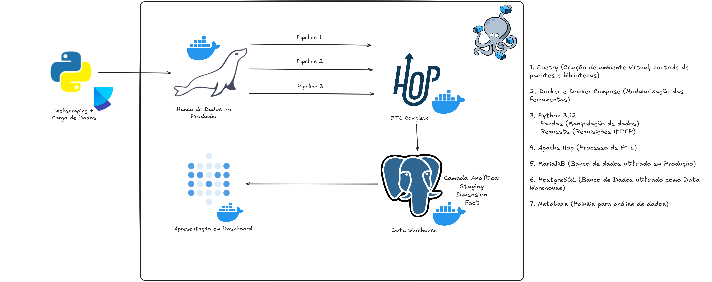
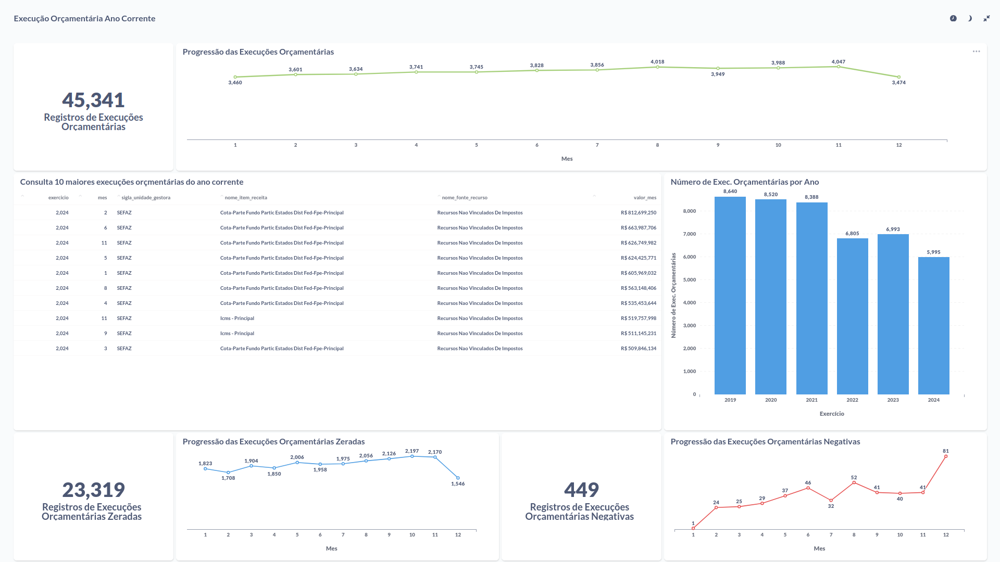

# Acompanhamento da Execução Orçamentária do estado da Paraíba, Brasil
# 1.0. Sumário
Esse projeto tem como objetivo construir um Data Warehouse para a observação da Execução Orçamentária do estado da Paraíba. 
O projeto foi desenvolvido como uma forma de demonstrar nossas habilidades como Engenheiro de Dados, enquanto utilizando um conjunto de dados públicos disponibilizados pela Plataforma de dados abertos do Estado da Paraíba e mantido pela CODATA - Companhia de Processamento de Dados da Paraíba. 
Os dados foram obtidos no portal através do endereço a seguir: https://dados.pb.gov.br/, um banco de dados em produção foi abastecido com esses dados brutos, em seguida foi realizado um processo de ETL com Apache Hop para um Data Warehouse, sendo analisados e disponibilizados em formatos de painéis utilizando a ferramenta Metabase. 
Toda a infraestrutura do projeto foi modularizada com Docker e as ferramentas podem ser montadas com a ajuda de Docker Compose utilizando o script em docker-compose.yml aqui disponibilizado.

# 2.0. Dicionário de Dados
As descrições dos dados a seguir foram disponibilizadas pelo própria Plataforma de Dados Abertos do Estado da Paraíba. 
Buscamos os dados da Execução Orçamentária e enriquecemos esse conjunto com os dados das Unidades Gestoras e Fontes de Recursos, como foram de obter maior legibilidade para o conjunto de dados.

## 2.1. Receitas - Execução
| CAMPO                               | TIPO DE CONTEÚDO | TAMANHO | DESCRIÇÃO                                                     |
|-------------------------------------|------------------|---------|---------------------------------------------------------------|
| EXERCICIO                           | Inteiro          |         | Exercício fiscal, o ano da receita                            |
| MES                                 | Inteiro          |         | O mês de arrecadação da receita                               |
| CODIGO_UNIDADE_GESTORA              | Texto            |       6 | Código SIAF do Órgão (Unidade Gestora)                        |
| CODIGO_ITEM_RECEITA                 | Texto            |       9 | Código completo do item da receita                            |
| NOME_ITEM_RECEITA                   | Texto            |     200 | Descrição do item da receita                                  |
| CODIGO_FONTE_RECURSO                | Texto            |       5 | Código da Fonte de Recurso                                    |
| VALOR_MES                           | Numérico         |    18,2 | Importância arrecadada no mês                                 |
| CODIGO_CATEGORIA_RECEITA            | Texto            |       1 | Código da categoria econômica da receita                      |
| CODIGO_ORIGEM_RECEITA               | Texto            |       1 | Código da origem da receita                                   |
| CODIGO_ESPECIE_RECEITA              | Texto            |       1 | Código da espécie da receita                                  |
| CODIGO_RUBRICA_RECEITA              | Texto            |       1 | Código da rubrica da receita                                  |
| CODIGO_ALINEA_RECEITA               | Texto            |       2 | Código da alínea da receita                                   |
| CODIGO_SUBALINEA_RECEITA            | Texto            |       2 | Código da sub alínea da receita                               |

## 2.2. Unidade Gestora
| CAMPO                               | TIPO DE CONTEÚDO | TAMANHO | DESCRIÇÃO                                                     |
|-------------------------------------|------------------|---------|---------------------------------------------------------------|
| EXERCICIO                           | Inteiro          |         | Exercício fiscal, o ano da despesa                            |
| CODIGO_UNIDADE_GESTORA              | Texto            |       6 | Código SIAF do Órgão (Unidade Gestora)                        |
| SIGLA_UNIDADE_GESTORA               | Texto            |      20 | Sigla do Órgão (Unidade Gestora)                              |
| NOME_UNIDADE_GESTORA                | Texto            |     100 | Nome do Órgão (Unidade Gestora)                               |
| TIPO_ADMINISTRACAO_UNIDADE_GESTORA  | Texto            |       1 | Identificação do Tipo de Administração da Unidade Gestora     |

## 2.3. Fonte de Recursos
| CAMPO                               | TIPO DE CONTEÚDO | TAMANHO | DESCRIÇÃO                                                     |
|-------------------------------------|------------------|---------|---------------------------------------------------------------|
| EXERCICIO                           | Inteiro          |         | Exercício fiscal, o ano da despesa                            |
| CODIGO_FONTE_RECURSO                | Texto            |       5 | Código da Fonte de Recurso                                    |
| NOME_FONTE_RECURSO                  | Texto            |     150 | Denominação da Fonte de Recurso                               |

# 3.0. Tecnologias Utilizadas e Instruções

    

## 3.1. Ferramentas 
- Poetry (Criação de ambiente virtual, controle de pacotes e bibliotecas)
- Docker e Docker Compose (Modularização das ferramentas)
- Python 3.12
    - Pandas (Manipulação de dados)
    - Requests (Requisições HTTP)
- Apache Hop (Processo de ETL)
- MariaDB (Banco de dados utilizado em Produção)
- PostgreSQL (Banco de Dados utilizado como Data Warehouse)
- Metabase (Painéis para análise de dados)

## 3.2. Requerimentos em Python
Os requerimentos estão disponibilizados no arquivo [pyproject.toml](./pyproject.toml) e podem ser instalados com Poetry ou manualmente com um gerenciador de pacotes.
- python = "^3.12"
- pandas = "^2.2.3"
- requests = "^2.32.3"

## 3.3. Como Reproduzir Esse Projeto
### ATENÇÃO, o repositório já contém todos os arquivos prontos, se você deseja recriar todo o processo aqui descrito, apague os conteúdos dos bancos de dados em produção (MariaDB) e do Data Warehouse (PostgreSQL), além do conteúdo do Metabase.

1. Certifique-se de ter instalado Python na versão 3.12, e as bibliotecas apontadas no arquivo pyproject.toml. Para isso, tenha Poetry instalado, e no repositório entre o comando via terminal `poetry install`. Rode o script [main.py](./main.py) com `poetry run python main.py` e aponte os inputs esperados no terminal.

2. Com Docker instalado, prepare todos a infraestrutura com o arquivo [docker-compose.yml](./docker-compose.yml). O arquivo foi elaborado com o objetivo de que os dados sejam retidos mesmo se os contêiners forem parados. O conteúdo da pasta de dados também serve como uma ponte entre os dados armazenados localmente, obtidos com o script em Python, e os arquivos das pipelines em .hpl, executados com Apache Hop, armazenados na pasta shared-data.

3. Tenha preparado também um arquivo .env separado com as variáveis para MariaDB e PostgreSQL. Normalmente essas credenciais não devem ser compartilhadas, mas como estamos disponibilizando bancos de dados com o propósito de reproducibilidade isso não deve ser um problema:

- MYSQL_ROOT_PASSWORD=rootpassword123
- MYSQL_USER=mariadb_user
- MYSQL_PASSWORD=userpassword123
- MYSQL_DATABASE=producao

- POSTGRES_USER=postgres
- POSTGRES_PASSWORD=postgress123
- POSTGRES_DB=hop_db

4. Abra o Apache Hop em http://localhost:8080/ui e na aba lateral, no botão **Metadata** procure a opção **Relational Database Connection** e configure as conexões com os bancos de dados (eles já devem estar configurados, mas caso não estejam devem ser preparados). Os drivers apropriados se encontram na pasta [drivers](./drivers/) e preparamos o docker-compose.yml de forma que os drivers estejam disponíveis dentro do contêiner. Em seguida, apague os schemas e as tabelas de ambos os bancos de dados. Execute as pipelines na ordem apresentada nos pontos 4.2, 4.3 e 4.4 da descrição do projeto da seguinte maneira:
- Na parte superior procure as opções de Project e Environment, selecione data_warehouse para Project e data_warehouse_env para Environment
- Na pipeline do ponto 4.2, acesse o último step em producao.receita_final, selecione o botão de SQL e execute a função para criar a tabela onde será inserida a informação.
- No Data Warehouse (nosso banco Postgres) crie um schema chamado dim_orcamento.
- Nas pipelines 2_dim_unidade_gestora, 2_dim_fonte_recurso e 2_dim_item_receita, também recrie as tabelas acessando a última step de cada pipeline e o botão SQL em cada uma delas. Rode as pipelines e aguarde o fim da execução.
- No Data Warehouse crie um schema chamado fact_orcamento.
- Na pipeline 3_fato_execucao_orcamento, recrie a tabela também acessando a última step e o botão SQL e em seguida rode a pipeline.

5. Abra o Metabase em http://localhost:3000/ configure uma conta de acesso e a conexão com o Data Warehouse para examinar e modificar o painel analítico (no campo de host, indique o nome do serviço **postgres-db**).

# 4.0. Descrição do Projeto
## 4.1. Aquisição dos Dados
Os dados foram adquiridos através de um script em Python escrito no arquivo main.py que itera realizando requisições e armazenam os dados em formato csv por ano e mês. O arquivo main.py espera um input do usuário de quais anos quer obter os dados, entre os anos 2000 e 2024 (que são os dados disponibilizados, até o momento, no portal https://dados.pb.gov.br/). O script faz o download, armazena e concatena conjuntos referentes a execução das receitas, as unidades gestoras e as fontes de recursos (e pula os anos e meses que já estão armazenados localmente), sendo gerados ao final desse processo três arquivos: receita_pb.csv, fonte_recurso_pb_final.csv e unidade_gestora_pb_final.csv.

## 4.2. Carga inicial em Banco de Dados em Produção
A carga inicial foi realizada com Apache Hop através de pipelines disponibilizadas em [1_carga_inicial.hpl](./data/1_carga_inicial.hpl), onde a carga é feita no schema producao e em tabelas diferentes (uma para cada csv), com o esquema disponível abaixo:

    

Bem como em [1_carga_inicial_joins.hpl](./data/1_carga_inicial_joins.hpl), onde a carga também é feita no schema producao com os dados disponibilizados em uma única tabela.

    

O objetivo dessa etapa é simular o ambiente em produção, aqui um banco de dados MariaDB, sobre o qual iremos realizar a construção da camada analítica em um banco de dados separado com o objetivo não apenas em agilizar a análise dos daos, mas também aliviar os custos no banco de dados em produção.

## 4.3. Construção das Tabelas Dimensão
Nessa etapa os dados são obtidos do banco de dados em produção, isolados em tabelas dimensão e armazenados no banco de dados analítico, aqui um banco de dados PostgreSQL, que alimentará a ferramenta de BI onde estará disponibilizado um painel analítico.

### 4.3.1. Dimensão Fonte Recurso
A tabela dimensão nomeada dim_fonte_recurso foi armazenada no schema dim_orcamento com as colunas codigo_fonte_recurso (a chave primária) e nome_fonte_recurso. A pipeline está disponível em [2_dim_fonte_recurso.hpl](./data/2_dim_fonte_recurso.hpl) e os passos necessários encontram-se abaixo:

    

### 4.3.2. Dimensão Unidade Gestora
A tabela dimensão nomeada dim_unidade_gestora foi armazenada no schema dim_orcamento com as colunas codigo_unidade_gestora (a chave primária), sigla_unidade_gestora, nome_unidade_gestora e tipo_administracao_unidade_gestora. A pipeline está disponível em [2_dim_unidade_gestora.hpl](./data/2_dim_unidade_gestora.hpl) e os passos necessários encontram-se abaixo:

    

### 4.3.3. Dimensão Item Receita
A tabela dimensão nomeada dim_item_receita foi armazenada no schema dim_orcamento com as colunas exercicio, mes, codigo_unidade_gestora, codigo_item_receita (a chave primária), nome_item_receita, codigo_fonte_recurso e valor_mes. A pipeline está disponível em [2_dim_item_receita.hpl](./data/2_dim_item_receita.hpl) e os passos necessários encontram-se abaixo:

    

## 4.4. Construção da Tabela Fato
As tabelas dimensão são unidas em uma nova camada analítica chamada fato representando cada uma das dimensões unidas em torno da execução de um item do orçamento do Estado da Paraíba por uma unidade gestora em determinado mês e ano. Uma coluna com a chave primária de cada uma dessas execuções foi criada como execucao_id e as colunas reunidas foram: exercicio, mes, codigo_unidade_gestora, sigla_unidade_gestora, nome_unidade_gestora, codigo_item_receita, nome_item_receita, codigo_fonte_recurso, nome_fonte_recurso e valor_mes. Os dados foram armazenados em um schema chamado fact_orcamento. A pipeline está disponível em [3_fato_execucao_orcamento.hpl](./data/3_fato_execucao_orcamento.hpl) e os passos necessários encontram-se abaixo:

    

## 4.5. Visualização dos Dados em Painéis
Os dados podem ser examinados e acompanhados utilizando Metabase. O banco de dados PostgreSQL foi conectado ao Metabase e um painel analítico com os valores positivos, zerados e negativos foi preparado conforme a disposição abaixo:

    

Podem ser formuladas questões de negócio para inquirir a tabela fato e construir novos paineis com a ajuda dessa ferramenta. Os dados, apesar de disponibilizados com a ajuda da ferramenta, também podem ser baixados em formato .csv, .xlsx, .json ou .png.

# 5.0. Conclusão e Próximos Passos
Atingimos nosso objetivo de construir um Data Warehouse utilizando Apache Hop: foi possível extrair os dados de um banco de dados em produção, produzir tabelas dimensão e uma tabela fato, fazendo a carga em um banco de dados apropriado para a tarefa. O projeto é complementado com outras ferramentas que são apropriadas para a tarefa de um Engenheiro de Dados, já que utilizamos Python para a aquisição dos dados brutos, e Metabase como ferramenta de BI para servir os dados transformados na tabela fato. Mas há melhorias que podem ser feitas ao projeto:
1. Podem ser implementados testes no projeto de ETL também utilizando a ferramenta Apache Hop;
2. Uma nova tabela dimensão utilizando as colunas EXERCÍCIO e MES pode ser preparada para um uso como calendário;
3. A tabela dimensão dim_item_receita pode ser melhor atomizada retirando colunas que não sejam apropriadas para a construção da tabela fato.